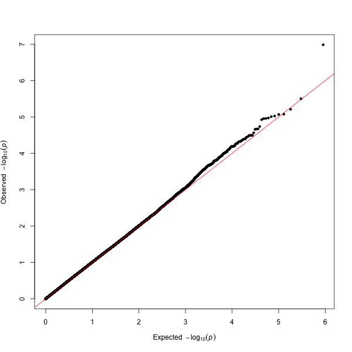
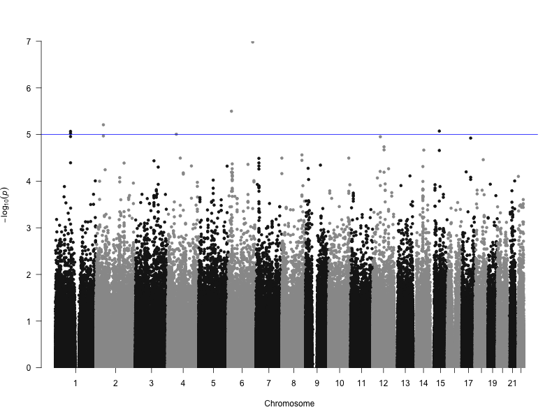

Practical: Genome-wide association studies
===
October 27, 2019

[Yoichiro Kamatani](kamatani@genome.med.kyoto-u.ac.jp)

As a part of The 7th McGill-Kyoto Training Course & Symposium 2019

Understanding genetic associaiton
==

Let's start with understanding and performing "genetic association testing" using the following data

||A/A|A/G|G/G|
|:--|:--:|:--:|:--:|
|Hepatitis B|42|240|324|
|Control|197|598|472|

In R, this can be expressed as

```r
> dat <- matrix(c(42, 240, 324, 197, 598, 472), byrow=T, nrow=2)
> dat
     [,1] [,2] [,3]
[1,]   42  240  324
[2,]  197  598  472
```

And it's allele model,

||A|G|
|:--|:--:|:--:|
|Hepatitis B|324|888|
|Control|992|1542|

by R,

```r
> dat.a <- cbind(dat[,1]*2+dat[,2],dat[,2]+dat[,3]*2)
> dat.a
     [,1] [,2]
[1,]  324  888
[2,]  992 1542
```

multiplied genotype count of A/A (or G/G) by 2 because they have two A (or G) alleles while A/G has one A (or G) allele.

We suppose this data is for 1212 hepatitis B chromosomes and 2534 controls chromosomes, which are sampled from much larger (infinite) population with certain population allele frequency (AF). 

The logic of genetic association test is as follows. First, assume AF in hepatitis B and in controls are the same (null hypothesis). Check the distribution of some statistic under null hypothesis. If the statistic of observed data is is quite rare observation under null distribution, we think this data is under alternative hypothesis (that is, AF in hepatitis B and in controls are different). 

Now, we calculate an overall A allele frequency as a population frequency under null hypothesis.

```r
> p0 <- colSums(dat.a)[1]/sum(dat.a)
```

The most likely data (i.e. expected values) under null hypothesis would be

```r
> dat.exp <- cbind(rowSums(dat.a)*p0, rowSums(dat.a)*(1-p0))
> dat.exp
         [,1]      [,2]
[1,] 425.7854  786.2146
[2,] 890.2147 1643.7853
```

Is this similar to the actual data? Maybe not. Number of A in cases is lower than this expected value, while A in controls is higher. The actual observations are different from expectations under null hypothesis. In other words, data indicates AF of cases and controls might be different.

Pearson's chi-squared test of independece can test this assertion. The following statistic

$X^2=\sum \frac{(O-E)^2}{E}$

is known to follow $\chi^2$ distribution under null hypothesis with degree of freedom (number of rows - 1) * (number of cols -1), in this case, 1.

What is chi-squared distribution with degree of freedom 1? We can draw it by R and check it.

```r
> curve(dchisq(x,1), 0, 10)
```

Please check how it looks like. This is the probability of taking certain $X^2$ value under null distribution. 

Let's calculate $X^2$ of our data. Think about vector calculation everytime when you use R.

```r
> mychisq <- sum((dat.a-dat.exp)^2/dat.exp)
```

Where is this $X^2$ value in the plot ? Obviously it exceeds the limit of the previous plot, so draw plot again with higher upper limit. 

```r
> curve(dchisq(x,1), 0, 100)
> abline(v= mychisq, col=2)
```

As I wrote above, the horizontal axis means probability. The probability $P(X^2= 55.45014)$ seems to be very small. It is

```r
> dchisq(mychisq, 1)
# Please check by yourself
```

`dchisq` returns values from chi-squared probability density function. In genetic association test (or in hypothesis testing in general), we want to know what is the probability of obtaining this **or rarer observations**. Therefore what we need is integration of probability $P(X^2)$ for all $X^2 > 55.45014$. A function is prepared to obtain this by R

```r
> 1 - pchisq(mychisq, 1)
# Please check by yourself
```

Here I use `pchisq`, not `dchisq` indicating cumulative density function. This is the P value obtained by Pearson's chi-squared independence of the allele model genetic association.

### Null distribution

Is `X^2` truely follow chi-squared distribution under null hypothesis? We can check it by simulation. 

The count of A allele from 1212 and 2534 chromosomes with frequency 0.3513081 can be simulated as

```r
> rbinom(10, 1212, p0)
 [1] 441 437 429 462 394 415 417 399 437 428
> rbinom(10, 2534, p0)
 [1] 886 879 896 896 872 867 907 858 848 907
```

You may observe different numbers since these are randomly generated.

Repeat this 10000 times and calcute $X^2$ for each case. There are several ways... I wrote like this, which is not elegant though

```r
> datnull <- data.frame(n11=rbinom(10000, 1212, p0), n21= > rbinom(10000, 2534, p0))
> datnull$n12 <- 1212 - datnull$n11
> datnull$n22 <- 2534 - datnull$n21
> datnull$X2 <- rep(0,10000)
> for(i in 1:10000) {
+ dat.s <- matrix(unlist(datnull[i,1:4]),nrow=2)
+ af.s <- colSums(dat.s)[1]/sum(dat.s)
+ dat.exp <- cbind(rowSums(dat.s)* af.s, rowSums(dat.s)*(1-af.s))
+ datnull$X2[i] <- sum((dat.s - dat.exp)^2/dat.exp)
}
```

Check the histogram of null distribution

```r
> hist(datnull$X2)
```

The frequency of $X^2$ more than 5 is

```r
> length(datnull$X2[datnull$X2 > 5])
```

and the chi-squared distribution gives

```r
> 1-pchisq(5,1)
```

Are these similar ?

Compare with cumulative probability at multiple points

```r
> res <- data.frame(x=1:15)
> res$chisq <- 1-pchisq(res$x,1)
> for(i in 1:15) res$sim[i] <- length(datnull$X2[datnull$X2 > i])/10000
> plot(res$chisq,res$sim)
> abline(0,1,col=2)
```

You may confirm that chi-squared distribution with degree of freedom 1 is a distribution of $X^2$ statistics for the allele counts when we assume the backgroud AF of cases and controls are the same.

### Yates' correction

In fact, the hepatitis B paper I showed at the lecture further applied Yates' correction. We can actually obtain this by automatic function

```r
> chisq.test(dat.a)
# Please check by yourself
```

This gives the same value in the hepatitis B paper. Yates' correction is said to be useful when the sample size is small; however there is some criticism.

To obtain original Pearson's test P value,

```r
> chisq.test(dat.a, correct=F)
# Please check by yourself
```

### Fisher's exact test

Another test of genetic association is Fisher's exact test, which do not assume infinite size population but to see the distribution of contingency table given 1212 hepatitis B chromosomes and 2534 controls chromosomes. I omit detailed explanation. By R, you can get the result

```r
> fisher.test(dat.a)
# Please check by yourself
```

For large sample size (without any smaller counts in the table) it is generally equivalent with Pearson's test, and if the number is small, exact test is better.

### Armitage trend test

To see the alleleic effect, we generated allele-model table and did hypothesis testing for 2x2 table. But this is not the sigle way to see alleleic model effect.

In trend test, the trend (increased risk from A/A to A/G, then A/G to G/G) can be evaluated.

```r
> prop.trend.test(dat[1,],dat[1,]+dat[2,])
# Please check by yourself
```

### Logistic regression analysis

Finally, you can try regression analysis. This is equivalent to trend test without covariates.

Like trend test, we do not use allelic table but genotypic table. The number of A allele is counted for each individual (additive genetic model), thus this is also allele model genetic test.

Try to create individual data from the table. Check the dataframe by `head` command.

```r
> datind <- data.frame(a=c(rep(2,42),rep(1,240),rep(0,324),
+					 rep(2,197),rep(1,598),rep(0,472)),
+ 				 y=c(rep(1,606), rep(0,1267)))
> head(datind)
# Please check by yourself
```

Here $y$ is phenotypic value where 1 is affected by hepatitis B, 0 is not. $a$ is the number of alleles the individual has.

Then logistic regression analysis can be performed as follows

```r
> summary(glm(y~a, data=datind, family=binomial(link="logit")))
# Please check by yourself
```

To fully understand this you may have to learn so many things, but simply, please confirm that the P value for `a` (allelic effect) is similar to what we have seen by Pearson's test or exact test. 

We can put `d` (dominance) term

```r
> datind$d <- ifelse(datind$a == 1,1,0)
> summary(glm(y~a+d, data=datind, family=binomial(link="logit")))
```

In this toy example, the existence of dominance effect can be assesed by P value for this dominance effect term. You can see the flexible nature of logistic regression analysis.

Get started for GWAS
==

GWAS is simply genome-wide genetic association test. 

To do this, usually researchers uses [plink](https://www.cog-genomics.org/plink2) software. So the purpose of latter half is to learn how to use plink.

I put some files for training.

```
~kamatani/pub/data
```

We will start with `sim1.{bed,bim,fam}` at this location. These files includes simulated genotype data for 200 individuals and 451,631 variants. The file format is explained at [this page](http://zzz.bwh.harvard.edu/plink/binary.shtml).

You can access directly to these files in this directory. Note that you have no priviledge to write anything onto this directory. The output file location must be specified appropriately under your home.

Alternatively you can copy them to your home. For example, following command may copy `sim1.fam` file to your current directory.

```sh
$ cp /home/kamatani/pub/data/sim1.fam .
```

Or you can get the data (with this md file from github page.

```sh
$ git clone https://github.com/ykamatani/KyotoCourse2018_GWAS.git
```

Quality control
==

After you obtain genotype data, the first thing you need to do is quality control (QC).

QC is essential in any kind of big data. This facilitates further analysis result to become valid. If you don't care about the quality of your data, you might be led to many false results.

Unfortunately the data set you are using is simulation data. Since I did not simulate experimental error, following commands may indicate that the data is completely clean. This is not a case in real data. Your actual data may contain errors. 

I will describe only the process to check quality. For real data, I expect you do these QC process, and see the results carefully by yourself!

### missing rate

Firstly, check genotype missing rate.

```sh
plink \
	--bfile sim1 \
	--missing \
	--out sim1.qc1
```

then you will get two files, `sim1.imiss` and `sim1.lmiss`. The former file is for sample level missing rate, while the latter file is for variant level missing rate.


Typically we filter out subjects with missing rate > 0.05, and variants with missing rate > 0.02. The threshold can be changed according to genotyping platform and laboratoty. It is good idea to see the distribution first.

### heterozygosity

Excess heterozygosity generally indicates contamination, or mixed bred. check this

```sh
plink \
	--bfile sim1 \
	--het \
	--out sim1
```

You can check the distribution of heterozygosity.

```r
> het <- read.table("test/sim1.het",T)
> het$het <- (het$N.NM. - het$O.HOM.) / het$N.NM.
> hist(het$het)
```

Again, this is a simulated data, without contaminated sample. If you have contaminated sample, it will show heterozygosity deviated from this kind of distribution. You can exclude it by applying 4 SD threshold for example.

### Sex check

This is to check consistency between provided sex information and genetically inferred sex using X (and Y) chromosome data. 

This time I don't provide X/Y chromosome data so skip this.

### Check relatedness

Next is to check genetic relatedness since GWAS requires subjects to be unrelated. IBD analysis can infer the degree of relationship between pair of the subjects. 

Since IBD calculation can be affected by the correlation structure of the genome, we first *prune* the list of SNPs:

```sh
plink \
	--bfile sim1 \
	--mind 0.05 \
	--geno 0.01 \
	--hwe 0.05 \
	--indep-pairwise 50 5 0.2 \
	--out sim1
```

`--mind` and `--geno` sets missing rate filter. `--hwe` is Hardy-Weinberg test filter which will be explained later.

Then, IBD calculation is done by using this pruned SNPs.

```sh
plink \
	--bfile sim1 \
	--extract sim1.prune.in \
	--genome gz \
	--out sim1
```

Have a look on the result... You can judge relationship by using following table


Again this is a very simple simulation data and no related individuals were found. But, in reality several unknown related subjects can be found in your data. You need to take an action if you find such unknown pairs (cryptic relatedness)... remove relatedness from the sample, or take them into account at the analysis (mixed linear model association).

### Check geographical differences of the subjects

Population stratification also causes spurious associations, so we need to match geographical origin of cases and controls. The geographical origin can be inferred by principal component analysis.

Using reference samples is quite useful for interpretation. I put genotype files of [1000 genomes project](http://www.internationalgenome.org) at `~kamatani/pub/kgp/`

We first need to merge our file with 1000 genomes project (kgp) genotype data, and to do that, we need to match the nomenclature of variant names. For this course I have prepared SNP name matched and extracted KGP genotypes at `~kamatani/pub/kgp_trim`. In the future if you want to do the same way, do as follows.

```sh
c=22
gawk '{print $4,$0}' kgp/ALL.chr$c.phase3_v5.shapeit2_mvncall_integrated.noSingleton.genotypes.bim | sort | join - <( gawk '$1=='$c'{print $4,$0}' data/sim1.bim | sort) | gawk '($6==$12 && $7==$13) || ($6==$13 && $7==$12){print $3,$9}' > suppl/merge.$c.txt

plink --bfile kgp/ALL.chr$c.phase3_v5.shapeit2_mvncall_integrated.noSingleton.genotypes --extract suppl/merge.$c.txt --make-bed --out kgp_trim/kgp_trim.ALL.$c
mv kgp_trim/kgp_trim.ALL.$c.bim kgp_trim/kgp_trim.ALL.$c.bim.old
gawk '{print $2,NR,$0}' kgp_trim/kgp_trim.ALL.$c.bim.old | sort | join - <( sort suppl/merge.$c.txt ) | sort -k2 -n | gawk 'BEGIN{OFS="\t"} {print$3,$9,$5,$6,$7,$8}' > kgp_trim/kgp_trim.ALL.$c.bim
```

Then merge the data set and reference

```sh
plink --bfile data/sim1 \
	--bmerge kgp_trim/kgp_trim.ALL.bed kgp_trim/kgp_trim.ALL.bim kgp_trim/kgp_trim.ALL.fam \
	--make-bed \
	--out sim1+kgp \
	--allow-no-sex
```

Then prune SNPs. **Pruning** in the context of GWAS means that removing redundant SNPs. The genome of human and other organisms takes correlation structure because of linkage disequilibrium (see lecture materials). 

```sh
plink \
	--bfile sim1+kgp \
	--geno 0.01 \
	--maf 0.05 \
	--indep-pairwise 50 5 0.2 \
	--out sim1+kgp
```

You will get pruned SNP list `sim1+kgp.prune.in`. Then, use only these SNPs and do PCA.

```sh
plink --bfile sim1+kgp \
	--extract sim1+kgp.prune.in \
	--pca \
	--out sim1+kgp
```

Check the plot to see the population structure. Remove individuals from the analysis if necessary. I prepared a script, but you can do on your own by using R, python, and so on.

```sh
python scripts/plotPCA.py \
	--eigvec ../test/sim1+kgp.eigenvec \
	--poplab kgp/20130606_sample_info.txt \
	--out ../test/test
```

### GWAS

GWAS can be done simply

```sh
plink --bfile sim1 \
	--assoc \
	--out sim1
```

By using this option, allele-model chi-squared test will be performed genome-widely. By putting `fisher` just after `--assoc` you can perform Fisher's exact test genome-widely. This does not aim to adjust for any confounders.

The strongest confounders in genetic association test is population stratification and cryptic relatedness. For the latter, we have confiremd that sample are unrelated. For the former, we can adjust for that by using principal component scores as covariate in regression model.

```sh
# Pruning within this data set
plink --bfile sim1 \
	--indep-pairwise 50 5 0.2 \
	--out sim1

# PCA within this data set
plink --bfile sim1 \
	--extract sim1.prune.in \
	--pca \
	--out sim1.pruned
	
# GWAS adjusted for PC scores. Note that we need to add header to covariate file
plink --bfile sim1 \
	--logistic \
	--covar sim1.pruned.eigenvec \
	--covar-name pc1,pc2 \
	--out sim1.pc1-2
```

### Draw Q-Q and Manhattan plot

The quality of GWAS is evaluated by Q-Q plot. 

Now, let's transfer the gwas results from the server to your laptop

```sh
scp <your name>@<server name>:<path to your result>
```

Open R. Obtain `qqman` package. I also recommend to use "data.table" package which enables fast data loading.

```r
> install.packages("qqman")
> install.packages("data.table")
```

Read the result file and draw Q-Q plot. Note that, when you run regression analysis with covariates by `plink`, inference for covariates is also included. We only need inference for genetic variants.

```r
> # After installing packages, you need to import them
> library(qqman)
> library(data.table)
> 
> # Load GWAS results
> # For data.table users
> df <- fread("sim1.pc1-2.assoc.logistic")
> # If you want to stick to standard functions
> df <- read.table("sim1.pc1-2.assoc.logistic",T)
> 
> # You may have a look into the result file
> head(df)
> 
> # Remove redundant lines for covariates
> # Also, some SNPs showed NA result because of failure in convergence
> df0 <- subset(df, TEST == "ADD" & !is.na(P))
> # Draw Q-Q plot
> qq(df0$P)
```

You may get a figure like this. This indicates that the quality of current result is good.



Note that, in the real data analysis, sometimes you need to apply MAF filter, Hardy-Weinberg Equilibrium test filter, or some others if necessary. **if necessary** means that, if you don't observe good Q-Q plot like this, then you need to think about applying further filtration.

Then let's plot the associations.

```r
> manhattan(df0)
```



Usually $\alpha=5.0 \times 10^{-8}$ is considered as genome-wide significance level. Unfortunately we don't observe significant association.

### MLMA

This is one of the advanced analysis introduced at the lecture.

```
gcta64 \
	--bfile pub/data/sim1 \
	--make-grm \
	--out test/sim1 \
	--thread-num 20
```

Heritability can be calculated

```sh
gawk '{print $1,$2,$6-1}' sim1.fam > sim1.cc.phen
gcta64 --reml \
	--grm sim1 \
	--pheno sim1.cc.phen \
	--prevalence 0.02 \
	--out sim1.cc
```

MLMi


```sh
gcta64 --mlma \
	--bfile sim1 \
	--grm sim1 \
	--pheno sim1.cc.phen \
	--out sim1.cc
```

MLMe

```sh
gcta64 --mlma-loco \
	--bfile sim1 \
	--pheno sim1.cc.phen \
	--out sim1

# or
gcta64 --mlma-loco \
	--bfile pub/data/sim1 \
	--grm test/sim1 \
	--mlma-subtract-grm test/sim1.chr1 \
	--chr 1 \
	--pheno test/sim1.cc.phen \
	--out test/sim1.loco
```

## Pathway analysis

I you have time, you can further try post-GWAS analysis. From now, summary statistics will be used; you can use the GWAS result you have calculated, or use the publicly available one obtained from database, like [LDhub](http://ldsc.broadinstitute.org/ldhub/) or [jenger](http://jenger.riken.jp/en/result)

You may want to make a biological interpretation of GWAS result. One such way is pathway analysis. The distribution of GWAS statistics are evaluated whether they are enriched in the genes belong to certain biological pathway.

In this course, I show example usage of [Pascal software](https://www2.unil.ch/cbg/index.php?title=Pascal).

Firstly, if you are not analyzing European descent, you need to prepare custom reference data. I made data representing 1000 genomes project JPT population, which is feasible to our data set. (`~kamatani/pub/pascal`）

Next, we need to prepare P value file.

```sh
gawk '$5=="ADD" && $9 != "NA"{print $2 "\t" $9}' sim1.pc1-2.assoc.logistic > sim1.pc1-2.assoc.logistic.pval
```

That's it! Now we run Pascal analysis

```sh
./Pascal --pval ~/test/sim1.pc1-2.assoc.logistic.pval \
	--custom=JPT \
	--customdir=/home/kamatani/pub/pascal \
	--genescoring=sum \
	--runpathway=on 
```

It first calculates [VEGAS](https://vegas2.qimrberghofer.edu.au) type gene-level associations. Thereafter, evalute the enrichment in pathways.

**This may take time.** You can have a look on the pre-calculated results in `~kamatani/pub/pascalout/`.

For the detailed description, see [the Pascal website](https://www2.unil.ch/cbg/index.php?title=Pascal).

## Analysis using summary statistics

To perform following processes, please obtain [ldsc package](https://github.com/bulik/ldsc) first. Please also [obtain pre-calculated LD scores](https://github.com/bulik/ldsc#where-can-i-get-ld-scores).

In this example, please use "Rheumatoid Arthritis (European)" from [jenger](http://jenger.riken.jp/en/result). You can use Japanese / East-Asian result as well, but you may need some tuning.

### Heritability and bias estimation

```sh
mkdir ldsc
python python/ldsc/munge_sumstats.py \
	--sumstats pub/RA_GWASmeta_European_v2.txt.gz \
	--N-cas 14361 \
	--N-con 43923 \
	--snp SNPID \
	--a1 A1 --a2 A2 --p P-val \
	--signed-sumstats "OR(A1)",1 \
	--merge-alleles python/ldsc/bulik/w_hm3.snplist.bz2 \
	--out ldsc/RA_GWASmeta_European_v2
```

To calculate heritability

```sh
python python/ldsc/ldsc.py \
	--h2 ldsc/RA_GWASmeta_European_v2.sumstats.gz \
	--ref-ld-chr ldsc/bulik/eur_ref_ld_chr/ \
	--w-ld-chr ldsc/bulik/eur_w_ld_chr/ \
	--out RA_GWASmeta_European_v2
```

This is not liability-scaled. Put prevalence value

```sh
python python/ldsc/ldsc.py \
	--h2 ldsc/RA_GWASmeta_European_v2.sumstats.gz \
	--ref-ld-chr ldsc/bulik/eur_ref_ld_chr/ \
	--w-ld-chr ldsc/bulik/eur_w_ld_chr/ \
	--samp-prev 0.25 \
	--pop-prev 0.01 \
	--out RA_GWASmeta_European_v2_prev01
```

LD score regression is useful for number of analyses, but one of the application is to see the genome-wide bias (Intercept and Ratio); see the screen output and try to get an idea. 

In the first trial we used European GWAS result. Now let's apply this to Asian result (obtain "Rheumatoid Arthritis (Asian)" from [jenger](http://jenger.riken.jp/en/result))

```sh
python python/ldsc/munge_sumstats.py \
	--sumstats pub/RA_GWASmeta_Asian_v2.txt.gz \
	--N-cas 4873 \
	--N-con 17642 \
	--snp SNPID \
	--a1 A1 --a2 A2 --p P-val \
	--signed-sumstats "OR(A1)",1 \
	--merge-alleles python/ldsc/bulik/w_hm3.snplist.bz2 \
	--out ldsc/RA_GWASmeta_Asian_v2
	
python python/ldsc/ldsc.py \
	--h2 ldsc/RA_GWASmeta_Asian_v2.sumstats.gz \
	--ref-ld-chr ldsc/bulik/eas_ldscores/ \
	--w-ld-chr ldsc/bulik/eas_ldscores/ \
	--samp-prev 0.22 \
	--pop-prev 0.01 \
	--out RA_GWASmeta_Asian_v2_prev01
```

Any difference ?

### Partitioned heritablity

Which functional regions are the GWAS SNPs enriched in? You may further need to obtain [partitioned LD score](https://github.com/bulik/ldsc#where-can-i-get-ld-scores).

```sh
python python/ldsc/ldsc.py \
	--h2 ldsc/RA_GWASmeta_European_v2.sumstats.gz \
	--ref-ld-chr python/ldsc/bulik/1000G_EUR_Phase3_baseline/baseline. \
	--w-ld-chr python/ldsc/bulik/1000G_Phase3_weights_hm3_no_MHC/weights.hm3_noMHC. \
	--overlap-annot \
	--frqfile-chr python/ldsc/bulik/1000G_Phase3_frq/1000G.EUR.QC. \
	--out ldsc/RA_GWASmeta_European_v2.partition
```

Note that, apply this method to Asian data may require some modification of input files. We will prepare necessary data by `http://jenger.riken.jp` near future.
	
### Cell-type specificity

To see enrichment into cell-groups,

```sh
python python/ldsc/ldsc.py \
	--h2 ldsc/RA_GWASmeta_European_v2.sumstats.gz \
	--w-ld-chr python/ldsc/bulik/1000G_Phase3_weights_hm3_no_MHC/weights.hm3_noMHC. \
	--ref-ld-chr python/ldsc/bulik/1000G_Phase3_cell_type_groups/cell_type_group.6.,python/ldsc/bulik/1000G_EUR_Phase3_baseline/baseline. \
	--overlap-annot \
	--frqfile-chr python/ldsc/bulik/1000G_Phase3_frq/1000G.EUR.QC. \
	--out RA_Hematopoietic \
	--print-coefficients
```

As for the `cell_type_group names`, see `python/ldsc/bulik/1000G_Phase3_cell_type_groups/names`. 

For theoretical aspect, see [Hilary et al. Nat Genet 2015.](http://www.nature.com/ng/journal/v47/n11/abs/ng.3404.html)
